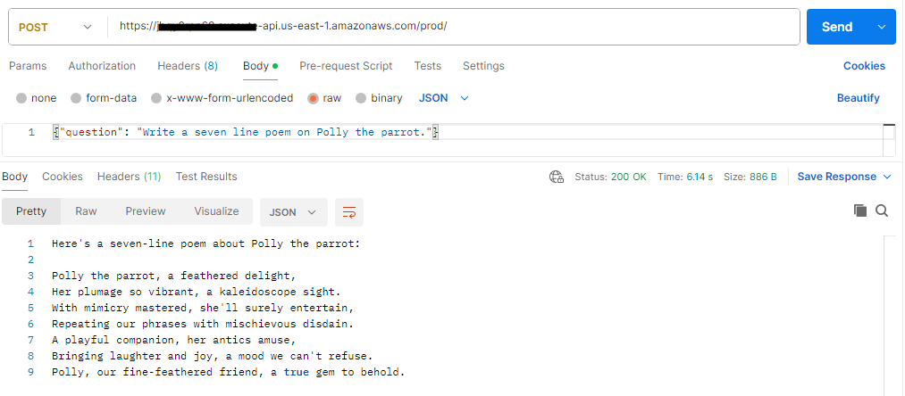

# Amazon Bedrock with Voice Response (Support visually impared users - 508)

In this example, we demonstrate [Amazon Bedrock](https://aws.amazon.com/bedrock/) with [Amazon Polly](https://aws.amazon.com/polly/) to convert the resulting ML response to MP3.  We then expose the model response using AWS API Gateway endpoint as a text and save the voice file in Amazon S3.

This application is developed using AWS CDK in TypeScript.

## Architecture

## What does it build?
* Creates and deploys Amazon BedRock with Anthropic's Claude3 Sonnet Model
* Creates a Lambda that will interact with the Model
* Creates a S3 bucket where voice files will be stored
* Creates Amazon Polly MP3 voice file from Model response and stores in S3
* Creates an AWS API Gateway endpoint to expose that Lambda which returns the model response in text format

## Steps to run and test
* Deploy the CDK code. Wait for the deployment to finish.  It will print out the API endpoint for you to use.
  * 
* Check your S3 bucket for the MP3 file created by Amazon Polly
  * 
* Download the MP3 file and play it to match with the output on screen

### Resulting Model Response 
  https://github.com/user-attachments/assets/592ae44d-399a-40d7-9a91-f86829fcc08e
* If the audio link doesn't play, download the original Amazon Polly created file in [MP3](8ef96afe-3dcf-49ad-89e7-1a6ca1d3c84a.mp3) format under files.

## References
* [Amazon Bedrock](https://aws.amazon.com/bedrock/)
* [Amazon Polly](https://aws.amazon.com/polly/)
* [508 Compliance](https://www.section508.gov/)

## Additional Guidance
* This example doesn't have a UI.  It will be ideal the serve that MP3 using a UI.  Please remember to use aria tags.
* Prefer streaming over storing voice file in S3
* Prefer Step functions for the lambda tasks
* I do not use voice command to interact with the Bedrock model.  Maybe I will do that in the future using AWS Transcribe...
